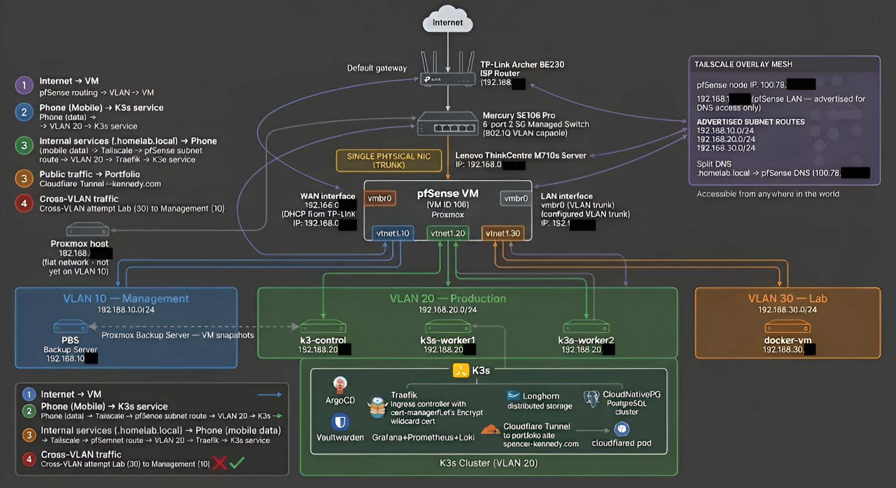

# THE MONOLITH — Home Lab

> "Enterprise-grade is a mindset, not a price tag."

A self-hosted infrastructure lab running on a Lenovo ThinkCentre M710s (i7-7700, 16GB RAM, 480GB SSD). Built from scratch to mirror real enterprise cloud architecture — network segmentation, GitOps, distributed storage, observability, and automated backups.

This repo is the ArgoCD source of truth for all Kubernetes workloads. Every service running on the cluster is defined here. Nothing is applied manually.

---

## Architecture



**Network:**
Three isolated VLANs behind a pfSense firewall, enforcing default-deny between segments. Same model as Azure VNet/subnet/NSG — just running on a $20 managed switch.

```
Internet → TP-Link router → pfSense VM (firewall + router)
                                 │
                    ┌────────────┼────────────┐
                VLAN 10       VLAN 20       VLAN 30
             Management     Production       Lab
           192.168.10.0/24  192.168.20.0/24  192.168.30.0/24
               PBS            K3s nodes       docker-vm
```

Remote access via Tailscale mesh VPN. pfSense advertises all three VLAN subnets as routes — internal services reachable from anywhere without exposing anything publicly.

**Kubernetes (K3s):**
3-node cluster (1 control plane tainted, 2 workers). ArgoCD watches this repo and reconciles the cluster state on every push. Longhorn provides distributed persistent storage across all three nodes.

**CI/CD (portfolio app):**
Code push → GitHub Actions → Trivy scan (CRITICAL blocks) → Docker build → SHA-tagged push to Docker Hub → SHA update in this repo → ArgoCD detects drift → deploys.

---

## Stack

| Layer | Tool | Purpose |
|---|---|---|
| Hypervisor | Proxmox VE | VM management |
| Firewall | pfSense | VLAN routing, DNS, NAT |
| Switch | Mercury SE106 Pro | 802.1Q VLAN tagging |
| Container orchestration | K3s | Lightweight Kubernetes |
| GitOps | ArgoCD | Declarative cluster management |
| Ingress | Traefik | Reverse proxy + TLS termination |
| Storage | Longhorn | Distributed persistent volumes |
| Database | CloudNativePG | PostgreSQL cluster with automatic failover |
| Observability | Prometheus + Grafana + Loki + Alloy | Metrics, dashboards, logs |
| Certificates | cert-manager + Let's Encrypt | Wildcard TLS for *.spencer-kennedy.com |
| Secret management | Vaultwarden | Self-hosted password manager |
| Backups | Proxmox Backup Server | Daily VM snapshots, tested RTO < 10 min |
| Tunnel | Cloudflare Tunnel | Public portfolio only — no open ports |
| VPN | Tailscale | Private access to all internal services |
| Dependency updates | Renovate | Automated PR on chart/image updates |

---

## Services

| Service | Namespace | Access |
|---|---|---|
| Portfolio | default | spencer-kennedy.com (public) |
| Vaultwarden | default | vaultwarden.homelab.local (Tailscale) |
| Grafana | monitoring | grafana.homelab.local (Tailscale) |
| Prometheus | monitoring | Internal |
| Loki | monitoring | Internal |
| Longhorn UI | longhorn-system | longhorn.homelab.local (Tailscale) |
| ArgoCD | argocd | argocd.homelab.local (Tailscale) |
| Headlamp | kube-system | headlamp.homelab.local (Tailscale) |
| Alertmanager | monitoring | alertmanager.homelab.local (Tailscale) |
| Uptime Kuma | docker-vm | Internal (independent of K3s) |

---

## Repo Structure

```
homelab-gitops/
├── apps/
│   ├── argocd/          ArgoCD self-management
│   ├── cert-manager/    Certificate management
│   ├── cloudflared/     Cloudflare Tunnel
│   ├── cloudnativepg/   PostgreSQL operator
│   ├── longhorn/        Distributed storage
│   ├── monitoring/      Prometheus, Grafana, Loki, Alloy, Alertmanager
│   ├── portfolio/       Portfolio app + ingress
│   └── vaultwarden/     Password manager + CloudNativePG cluster
├── docs/
│   └── grafana/         Grafana dashboard JSON exports
└── bootstrap/           ArgoCD ApplicationSets (app-of-apps pattern)
```

---

## Key Design Decisions

**Why K3s over a managed service?** To understand what managed Kubernetes abstracts away. Debugging three stacked kernel networking bugs in week one taught more than six months of clicking in the Azure portal.

**Why pfSense over cloud-style segmentation?** Same reason. Azure NSGs are pfSense firewall rules. Understanding the concept at the metal level makes the cloud abstraction obvious.

**Why ArgoCD?** A Git push is the only way to change cluster state. No `kubectl apply` directly to production. Every change has a commit hash, a diff, and a rollback path.

**Why Longhorn?** Replicated storage across three nodes. A single node failure does not take down a persistent volume. Validated with live node kill tests.

**Why Tailscale over exposing services publicly?** Attack surface reduction. The only publicly reachable service is the portfolio via Cloudflare Tunnel. Everything else requires Tailscale.

---

## Build Journey

Documented publicly on [LinkedIn](https://www.linkedin.com/in/NPCkennedy) — real bugs, real decisions, real failures.
